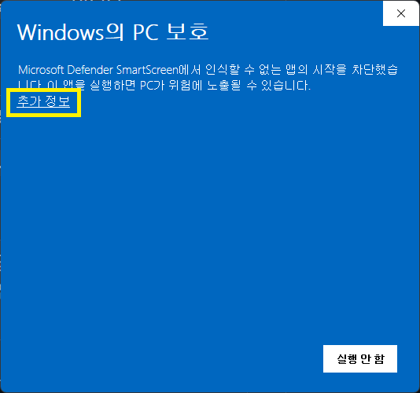
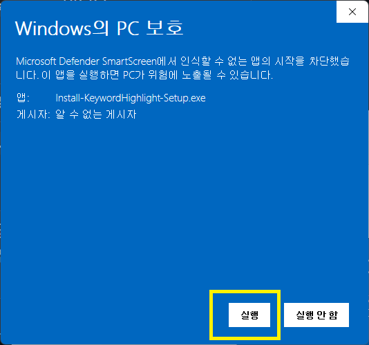
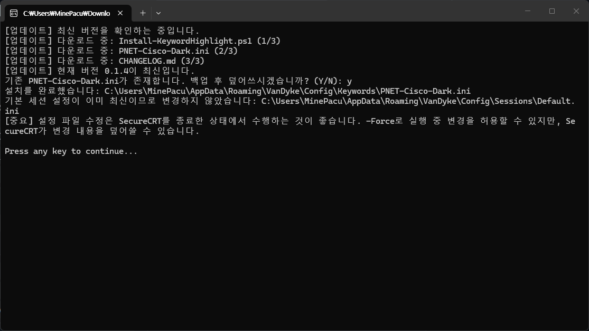
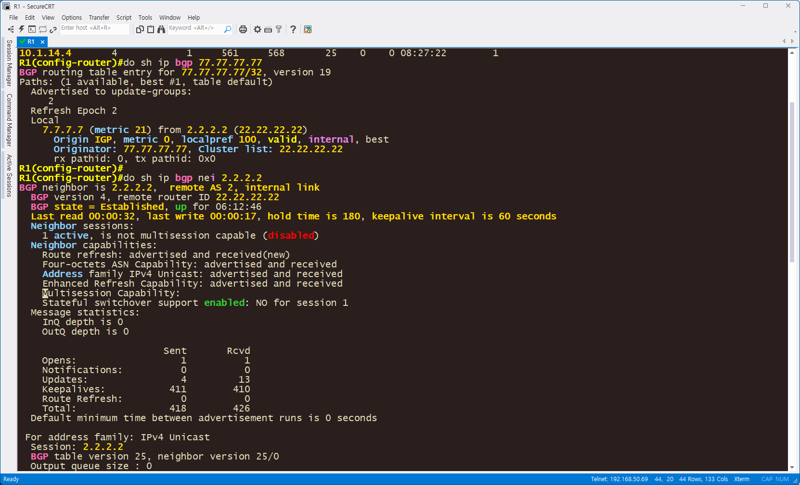

# CRT Cisco IOL Highlight 설치 안내서

## Windows 설치 가이드

### SecureCRT에 Cisco IOL 키워드 하이라이트 적용하기

이 안내서는 Windows에서 배포 ZIP을 풀고 설치 파일을 실행해 SecureCRT에 하이라이트를 적용하는 과정을 설명합니다. 사진은 나중에 추가할 수 있습니다.

> **이미지 파일을 넣은 뒤 경로를 맞추세요.**

각 이미지 자리표시자의 HTML 주석에 촬영 대상과 주의사항을 적어 두었습니다. 실제 사진을 넣을 때는 주석의 안내를 확인하고 이미지 경로를 실제 파일명에 맞게 바꾸세요. 특히 SmartScreen 사진은 먼저 `추가 정보`를 누르는 화면과, 확장된 뒤 `계속 실행` 또는 `실행`을 누르는 화면을 각각 넣어야 합니다.

대상 환경: Windows · SecureCRT · Cisco IOL CLI 출력

## 이 안내서에서 꼭 기억할 것

배포 ZIP을 먼저 전체 압축 해제하세요. 설치 파일만 따로 옮기지 말고, ZIP에서 함께 풀린 파일과 같은 폴더에 둔 상태로 실행해야 합니다.

설치 중 확인 질문에는 `Y/y`만 승인 입력으로 인식됩니다. `yes`나 `예`는 승인 입력이 아닙니다.

## 설치 전 체크리스트

설치를 시작하기 전에 아래 항목을 확인하면 중간에 멈추는 일을 줄일 수 있습니다.

- Windows 컴퓨터에서 작업하고 있는지 확인합니다.
- 설치 전에 SecureCRT를 완전히 종료합니다. SecureCRT가 실행 중이면 설치 스크립트가 계속할지 물을 수 있습니다.
- 배포 ZIP 전체를 받을 수 있는지 확인합니다. ZIP 안의 파일을 함께 보존해야 합니다.
- 기존 설정을 별도로 보관하고 싶다면 SecureCRT 설정 폴더를 추가로 백업합니다. 설치 프로그램도 기존 파일을 덮어쓰기 직전에 timestamp 백업을 만듭니다.

## 설치 흐름 한눈에 보기

1. 배포 ZIP을 다운로드합니다.
2. ZIP에서 `압축 풀기/Extract All`을 선택해 전체 압축을 풉니다.
3. 압축 해제 폴더에서 `Install-KeywordHighlight-Setup.exe`를 더블클릭합니다.
4. Windows Defender SmartScreen이 보이면 `추가 정보`를 클릭한 뒤 `계속 실행` 또는 Windows 버전에 따라 `실행`을 클릭합니다.
5. UAC가 표시되면 출처를 확인한 뒤 `예`를 클릭합니다.
6. PowerShell 설치 창이 끝날 때까지 기다립니다. 질문이 나오면 `Y/y`를 입력하고 Enter를 누릅니다.
7. 설치가 끝나고 `Press any key to continue`가 보이면 아무 키나 눌러 창을 닫습니다.
8. SecureCRT를 다시 시작하고 Cisco IOL 테스트 출력에 색상 하이라이트가 보이는지 확인합니다.

PowerShell 명령을 직접 입력할 필요가 없습니다. 아래에서는 배포된 원클릭 실행 파일을 더블클릭하는 흐름을 기준으로 설명합니다.

## 1. 배포 ZIP을 다운로드하고 실행 파일 열기

배포본은 실행 파일과 함께 필요한 파일이 들어 있는 폴더 또는 ZIP 전체를 배포하는 방식입니다. ZIP을 풀지 않고 실행하거나 실행 파일만 옮기면 설치에 필요한 파일을 찾지 못할 수 있습니다.

1. 배포 ZIP을 다운로드합니다. 다운로드가 끝날 때까지 기다립니다.
2. 다운로드한 ZIP을 마우스 오른쪽 버튼으로 클릭하고 `압축 풀기/Extract All`을 선택합니다. 파일 전체가 새 폴더에 풀리도록 합니다.
3. 압축 해제된 폴더를 열고 `Install-KeywordHighlight-Setup.exe`를 더블클릭합니다.

> **파일을 옮기지 마세요.** 설치가 끝날 때까지 실행 파일만 다른 폴더로 옮기지 마세요. ZIP에서 함께 풀린 파일과 같은 폴더에 둔 상태로 실행해야 합니다.

ZIP 전체를 압축 해제한 뒤 새 폴더를 엽니다.

파일을 폴더 밖으로 옮기지 말고 더블클릭합니다.

## 2. Windows Defender SmartScreen에서 계속 실행

처음 표시된 SmartScreen 창에서 배포 출처와 파일 이름이 예상한 것과 맞는지 확인합니다.

> ⚠️ **`계속 실행` 버튼 주의**
>
> SmartScreen 화면이 보이면 전체 SmartScreen을 해제하지 마세요. 먼저 `추가 정보`를 클릭하고, 확장된 화면에서 출처를 확인한 뒤 `계속 실행`을 클릭하세요. Windows 버전에 따라 버튼이 `실행`으로 표시될 수 있습니다.

1. 화면에 `추가 정보`가 보이면 먼저 클릭합니다.
2. 내용이 펼쳐지면 `계속 실행`을 클릭합니다. Windows 버전에 따라 `실행`으로 표시될 수 있습니다.

<!-- 사진 3: SmartScreen 처음 표시된 화면에서 ‘추가 정보’ 버튼이 보이는 상태를 넣으세요. 안내 문구는 실제 사진으로 교체하세요. -->

먼저 `추가 정보`를 눌러 다음 선택지를 표시합니다.

<!-- 사진 4: SmartScreen 확장 화면에서 ‘계속 실행’ 또는 Windows 버전에 따른 ‘실행’ 버튼이 보이는 상태를 넣으세요. 안내 문구는 실제 사진으로 교체하세요. -->

출처를 확인한 뒤 `계속 실행` 또는 `실행`을 눌러 설치를 시작합니다.

## 3. UAC와 PowerShell 설치 창에서 진행하기

### UAC 권한 확인

Windows 사용자 계정 컨트롤(UAC) 창이 표시될 때만 진행합니다. 창에 표시된 게시자·출처가 배포한 파일과 일치하는지 확인한 뒤 `예`를 누릅니다. 출처가 예상과 다르면 설치를 중단하고 배포 담당자에게 확인하세요.

### PowerShell 창의 질문에 답하기

1. PowerShell 설치 창이 열리면 창을 닫지 말고 작업이 진행될 때까지 기다립니다.
2. SecureCRT가 실행 중이라는 확인 또는 기존 `Keywords\PNET-Cisco-Dark.ini`/`Sessions\Default.ini` 적용 확인이 나오면 `Y/y`를 입력하고 Enter를 누릅니다. `yes`나 `예`는 승인 입력이 아닙니다.
3. 설정 폴더 자동 탐색에 실패하면, `Sessions\Default.ini`가 들어 있는 SecureCRT 설정 폴더의 경로를 입력하고 Enter를 누릅니다. 파일 자체가 아니라 그 상위 설정 폴더 경로를 입력합니다.
4. 완료 메시지와 `Press any key to continue`가 보이면 아무 키나 눌러 창을 닫습니다.

설치 프로그램은 `Keywords\PNET-Cisco-Dark.ini`를 적용하고 `Sessions\Default.ini`의 기본 세션 옵션을 적용합니다. 기존 파일을 덮어쓰기 전에는 timestamp 백업을 만듭니다.

<!-- 사진 5: PowerShell 설치 창의 Y/N 질문 또는 완료 메시지와 Press any key to continue가 보이는 화면을 넣으세요. 안내 문구는 실제 사진으로 교체하세요. -->

질문에는 `Y/y`를 입력하고 Enter를 누릅니다. 완료 후 `Press any key to continue`가 보이면 아무 키나 눌러 창을 닫습니다.

## 4. SecureCRT를 다시 시작하고 색상 확인하기

1. 설치 창을 닫은 뒤 SecureCRT를 다시 시작합니다.
2. Cisco IOL 장비에 연결하거나 저장된 CLI 출력으로 아래 명령 결과를 확인합니다.

   - `show interfaces`
   - `show spanning-tree`
   - `show etherchannel summary`
   - `show standby`
   - `show ip ospf neighbor`

위 명령 중 하나를 실행하거나 해당 출력이 보이게 합니다. 상태, 인터페이스, STP, EtherChannel, HSRP, OSPF 관련 문자열에 색상 하이라이트가 보이는지 확인합니다.

## 문제 해결

### SmartScreen 버튼이 안 보일 때

Windows 버전에 따라 화면 구성이 다를 수 있습니다. 창에 `추가 정보`가 보이는지 먼저 확인하고, 그 다음 `계속 실행` 또는 `실행`을 찾습니다. SmartScreen 전체 해제는 안내하지 않습니다. 파일을 받은 배포 출처와 파일 이름을 다시 확인하고, 의심스러우면 실행하지 마세요.

### 설정 폴더를 찾지 못할 때

자동 탐색이 실패하면 `Sessions\Default.ini`가 실제로 들어 있는 SecureCRT 설정 폴더 경로를 입력합니다. `Sessions` 폴더나 `Default.ini` 파일만 단독으로 입력하지 않습니다. 경로를 모르면 SecureCRT 설정 폴더를 먼저 확인하세요.

### 색상이 안 보일 때

SecureCRT가 설치 전에 열려 있었다면 완전히 종료한 뒤 다시 시작합니다. 다시 시작해도 보이지 않으면 하이라이트가 적용된 세션으로 연결했는지, 출력이 실제 Cisco IOL 형식인지, 터미널 테마와 색상이 충돌하지 않는지 확인합니다.

### 압축을 풀지 않고 실행했을 때

ZIP을 먼저 `압축 풀기/Extract All`로 전체 해제한 뒤, 압축 해제 폴더 안에서 `Install-KeywordHighlight-Setup.exe`를 다시 실행합니다. 실행 파일만 다른 폴더로 옮기지 않습니다.

## 수동 INI 복사는 필요 없습니다

원클릭 설치 프로그램이 `Keywords\PNET-Cisco-Dark.ini`와 `Sessions\Default.ini`의 기본 세션 옵션을 함께 적용합니다. 설치 후 INI 파일을 별도로 복사하거나 세션 옵션을 수동으로 입력하지 않아도 됩니다.

## 설치 완료 체크리스트

아래 항목을 모두 확인하면 설치가 완료된 것입니다.

- 배포 ZIP을 전체 압축 해제한 폴더에서 실행했습니다.
- SmartScreen에서 `추가 정보` → `계속 실행`/`실행` 순서로 진행했습니다.
- UAC가 표시되었을 때 출처를 확인하고 `예`를 눌렀습니다.
- 설치 확인 질문과 기존 파일 적용 확인에 `Y/y`를 입력했습니다.
- 설정 폴더 자동 탐색 실패 시 `Sessions\Default.ini`가 들어 있는 설정 폴더 경로를 입력했습니다.
- 설치 완료 메시지와 `Press any key to continue`가 보인 뒤 키를 눌러 창을 닫았습니다.
- SecureCRT를 다시 시작했고 Cisco IOL 출력에서 색상 하이라이트를 확인했습니다.

<!-- 사진 6: 설치 후 SecureCRT를 다시 시작하고 Cisco IOL 출력에 색상 하이라이트가 표시된 화면을 넣으세요. 안내 문구는 실제 사진으로 교체하세요. -->

실제 배포본에서 색상 하이라이트가 보이는 최종 결과 사진을 확인합니다. 사진 3~6의 안내 주석과 설명을 참고해 필요한 스크린샷을 교체해 배포하세요.
